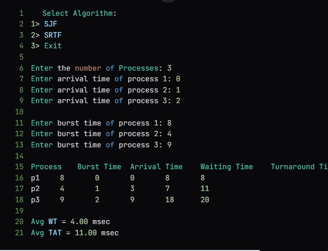

# SJF-SRTF-Scheduling-Simulation
This is implementation of SJF(non-preemptive sjf) & SRTF(preemptive sjf) cpu scheduling algorithms. 
Just download the file or copy the code then, compile to execute it.

# Overview 
 This project is undertaken to delve into the fundamental scheduling algorithms used in operating systems and their practical implementations. The rationale for choosing this topic is multi-faceted, one of the aspect is significance i.e. Scheduling is a critical aspect of OS, directly impacting system performance, resource utilization, and UX. Shortest Job First (SJF) and Shortest Remaining Time First (SRTF) are prominent scheduling algorithms known for their efficiency in minimizing waiting times and turnaround times.

# Output  

